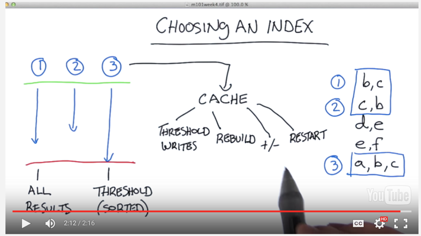
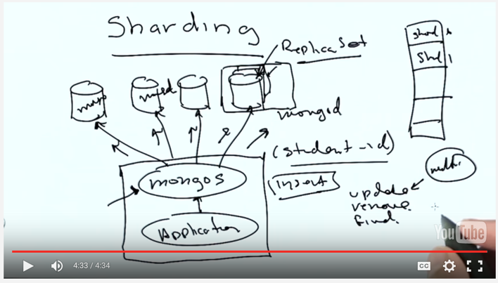

#MongoDB Week 5
[TOC]

##Storage Engine
The interface between persistent storage (disks, etc) and the database itself, the MongoDB server talk to the disk through the storage engine and all the indexes, data, file formats, etc are writing on the storage engine.
- Storage Engine has a control of memory so that it can decide what to put into the memory instead of the dis
- MongoDB offers pluggable engine 
 - MMAP
 - WiredTiger (default)
- if you have multiple DB servers, storage engine could not handle the communications between the servers

###MMAP
- Original MongoDB storage engine,
- Allocate the file, MongoDB needs store the documents into the file
 - When calling the MMAP, it maps the 100GB file into 100GB virtual memory; Then the memory is usually smaller like 32GB, so if you hit the doc in the memory, you can access them easily, but it doesn't, you have to go to the file in the disk and read them into memory. 
- MMAP offers:
 1. Collection Level Locking, each collection is on file, which means if you have two operations on the same collections at the same time. One will have to wait for the other because it is a multiple readers and single writer.
 2.  In Place Updates,
 3.  Power of Two sizes, so that you don't have to move the docs

###Wired Tiger
- Offers:
 1. Document level concurrency, in fact, it is actually a lock-free implementation. The algorithms assumes the two writes are not going to be at the same document. If they are, then one of the write would be invalid and has to try again, which is invisible to the app
 2. Compression of the data and indexes, it keeps clear in memory because you don't want to decompress it when you hit the data in memory. But it can be compressed before them are written into disks
 3. No in place updates, so every time you update a doc, it will mark the original one as no longer used and allocate new space on the disk then reclaims the space that no longer used
- often faster because no locks

##Index
if you don't have indexes and you wants to find out the document with name called ZOE, then you will have to scan all the documents/whole table.
- Index, could be imagine as an **ordered** list of things, each point of the index will have a pointer to the physical location on the disk
- if you have an object (with multiple fields) as an index, then you can use index as well but you have to search start with left node (so that the index could reduce scan utilizing the ordered list)
- Index will faster your reads but slower your writes because you have to use disks and time to store and maintain the database, so if you have a large set of data, you should insert them all first and after that, you create the index.


### Create Index
```db.student.createIndex({student_id:1})``` descending index on student_id
```db.student.createIndex({student_id:1, class_id:-1})``` 
**Tip**: 	```db.student.explain().find()```, chain any commands after ```explain() ``` to have an idea of how the db works

### Discover Index 
```db.student.getIndexes()```
### Delete Index
```db.student.dropIndex({student_id:1})```

###Multikey Index
- Indexes on the field which has an array as the values
- if you have an compound indexes that includes arrays, but when you have an index that is multikey and at lease one document has a value of being an array, you can't have a multiple values of a compound index both both be in an array

###Dot Notation
reach the subdocument and create index on it via dot notation
```db.student.createIndex({'scores.score':1})```
```db.student.find({'scores':{$elemMatch:{'type':'exam', 'score':{$gt:99.8}}}})```

```$elemMatch```it matches documents that it contains at least one document field with at least one element that matches all criteria 

but if you did the following:
```db.student.find({'$and':[{'type':'exam', 'score':{$gt:99.8}}]})```
which might return the scores with 'quiz' or 'homework''s score is greater than 99.8 but not for the exam

###Unique Index
index has to be unique in the collection
```db.fruit.createIndex({'thing':1}, {unique:true});```
Tips: remove just one duplicate document: ```db.fruit.remove({thing:'apple'}, {justOne: true});```

###Sparse Index
used when some keys of index are missing
```
{a:1, b:2, c:3}
{a:2, b:3, c:4}
{a:3, b:4}
{a:4, b:5}
```
you are able to create unique index on a or b, but not c because the last two documents both have the c with value ``` null```

So in this case, you can specify the **sparse option** which tells the database server that it should not includes in the index where the documents are missing the keys
Then, in the previous example, it would index the first two documents but the last two would not be indexed.
```db.fruit.createIndex({'thing':1}, {unique:true, sparse:true});```
**Note**: the sparse index cannot be used for sorting

###Foreground VS Background
- Foreground (default)
 - relative fast
 - block all writers and readers in the same database
 - so you might be want to do this in the production environment
- Background
 - slower
 - not block
 - can create multiple indexes in the background at the same database in parallel
``` db.fruit.createIndex({'thing':1}, {background:true});```


##Explain
- It does not complete the whole query or bring all the data back to the client
- It can not explain 'insert' command
```
var exp = db.example().explain() //get the explainable object
exp.help() //tell you all the operations that you can work
exp.find({a:17, b:45}).sort({b:-1})
```
most of time, if you can get a cursor from a query then you can just append the ```expain()``` after that, but ```remove``` command will not return the cursor, so you can not append expain() after that

### Mode
- queryzPlanner: what will use in the query
- executionStats: what's the result of the query and includes queryPlanner
 - ```var exp = db.example().explain('executionStats')```
- allPlanExecution: all plans includes the rejected ones to see the logic that database applies when it comes to choose a plan

##Covered Queries
the examined keys cover the examined documents, which means the ```'nExaminedDocs'``` is 0
In order to do this, you have to put the projection to be at least the subset of the index that is used

##Choosing index


##Index Size
make sure the size of the index can fit the memory
the index size can be considerably smaller (at the cost of some CPU space) in WiredTiger with --wiredTigerIndexPrefixCompression enabled.

Also, the db.collection.stats() is more verbose for WiredTiger, but will still give you all of this information.

##Number of Index
- regular: 1:1
- sparse: <= documents
- multikey:  > doucments, all arrays

##Geospatial Index
###2D
```
db.streets.ensureIndex({location: '2d', type:1}) 
db.streets.find({location: {$near:[50, 50]}})
```
###Spherical
```
...
location:{
	"type": "Point",
	"coordinates":[
		-122.1345354
		87.2342354345
	]
}
...

db.places.ensureIndex({"location":"2dsphere"})

db.places.find({
	location:{
		$near: {
		$geometry: {
			type: "Point",
			coordinates: [-122.12, 37/3345]},
		$maxDistance: 2000
		}
	}
})
```

##Full text search
```
db.sentences.ensureIndex({'words':'text'})
db.sentences.find({$text:{$search:'dog'}})
db.sentences.find({$text:{$search:'dog'}}, {score:{$mate:'textScore'}}).sort({'score': {$meta: 'textScore'}})
```
ignore capitalize or symbols like period, apply $or to multiple words 


##Design Index
- selectivity: minimize the records scanned
- other OPS: how are Sorts handled
```
db.students.find({student_id:{$gt:500000}, class_id:54}).sort({student_id:1}).hint({class_id:1}).explain("executionstats")
```
Note: use ```hint``` command to tell db to use one specific index
if the explainable object says stage "SORT", it means db is doing the in memory sorting; But in order to make the sort in the database, it has to exam more documents. It is a trade-off

##Logging slow queries
MongoDB automatically log the slow queries that slower than 100 ms
###Profiler
Three levels to debug and log the queries
- level 0: off
- level 1: log slow queries ```mongod --profile 1 --slowms 2``` log slower than 2ms, then you can find it via ```db.system.profile.find({ns:/test.foo/}).sort({ts:1})```, which find the test db foo collection
- level 2: log all queries
```
db.getProfilingLevel()
db.getProfilingStatus()
db.setProfilingLevel(1, 4)
```

##Other commands
###mongotop
```
mongotop 3 // which is similar to linux top command to monitor the mongo status
```
###mongostat

##Sharding overview

